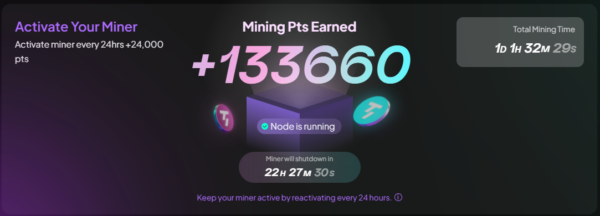

# Taker Bot Auto Activate Daily Mining And Buff Ref


Tool được phát triển bởi nhóm tele Airdrop Hunter Siêu Tốc (https://t.me/airdrophuntersieutoc)

## How ?

- Register here using new wallet: [https://taker.xyz](https://earn.taker.xyz?start=8WTC3)
- Bind your X/Twitter otherwise you can't start mining
- Wait till you get faucet reward (0.001 TAKER) to start using bot

## Requirements

- **Node.js**: Ensure you have Node.js installed.
- **Python**: Ensure you have Python installed.
- **npm**: Ensure you have npm installed.
- **Taker Balance**: Ensure you have a balance in your Taker wallet.

## Setup

1. Clone this repository:
   ```bash
   git clone https://github.com/Hunga9k50doker/taker.git
   cd taker
   ```
2. Install dependencies:
   Nodejs:

   ```bash
   npm install
   ```

   Python:

   ```bash
   pip install -r requirements.txt
   ```

   or

   ```bash
   pip3 install -r requirements.txt
   ```

3. Fill your wallet detail at `wallets.json`
   ```bash
   nano wallets.json
   ```
4. Run The Script:
   ```bash
   npm run start
   ```

## For termux error at installation:

Try these steps to install Web3 modules in Termux.
Please note that all steps may take a while, so be patient.

Install Rust and Binutils:

```bash
pkg install -y rust binutils
```

Install Maturin:

```bash
CARGO_BUILD_TARGET="$(rustc -Vv | grep "host" | awk '{print $2}')" pip install maturin
```

Install Web3:

```bash
pip install web3
```

Install all modules:

```bash
pip install -r requirements.txt
```

Once all steps completed, try running the script.

## 

This project is licensed under the [MIT License](LICENSE).
